## Лабораторная работа №1

**Задача:** Создать учетную запись пользователя, поработать с количеством входов, попытками, блокировка ввода, тестированием входа.

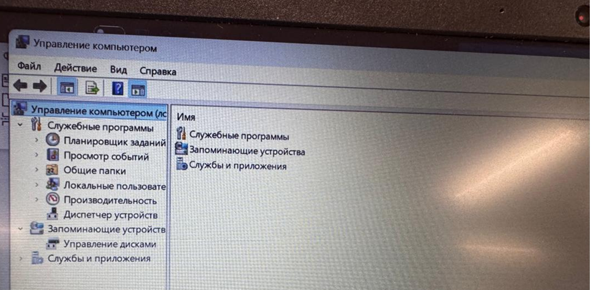
Заходим в Управление компьютером.

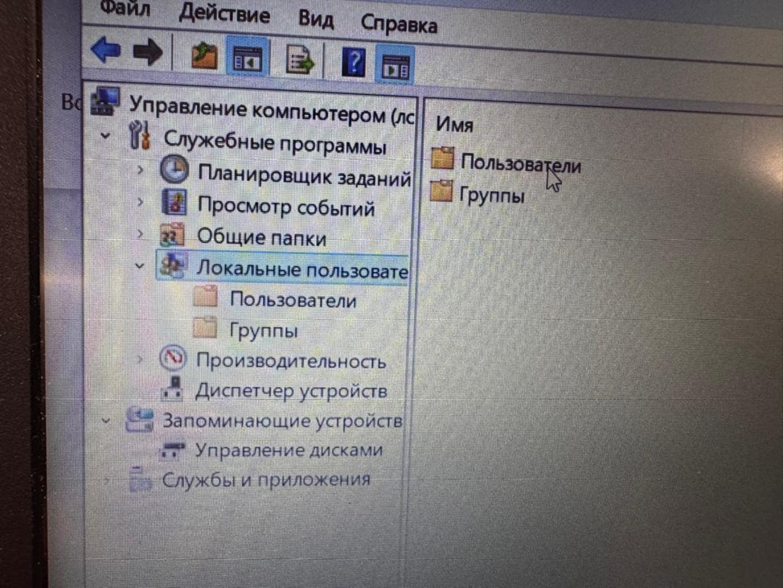
Заходим в раздел Локальные пользователи и далее в папку Пользователи.

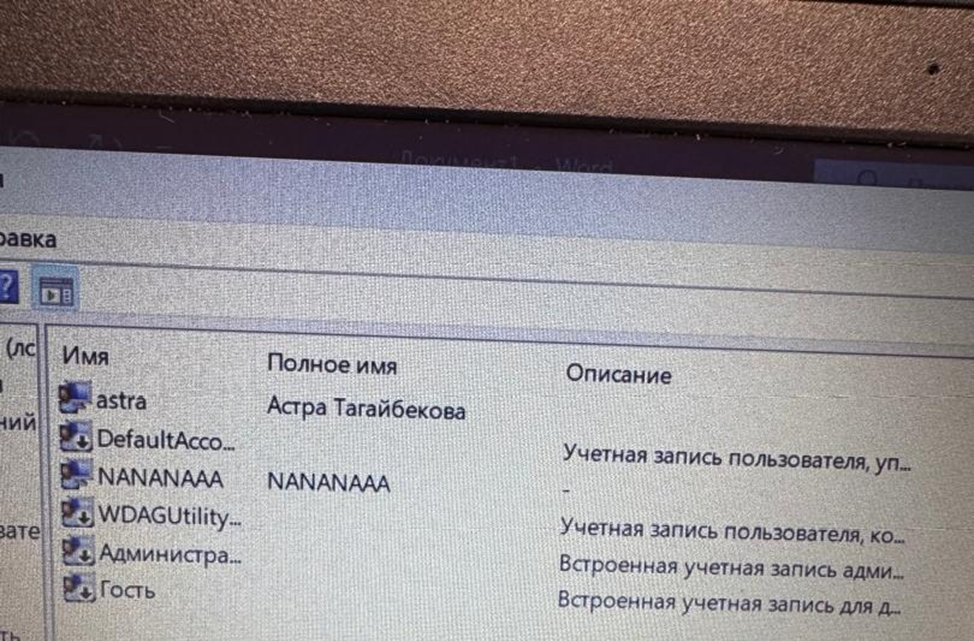
Здесь выйдет список пользователей, администраторов. Моего администратора зовут astra. Мне необходимо было создать пользователя, через которого я буду заходить. Я его назвала NANANAAA. 

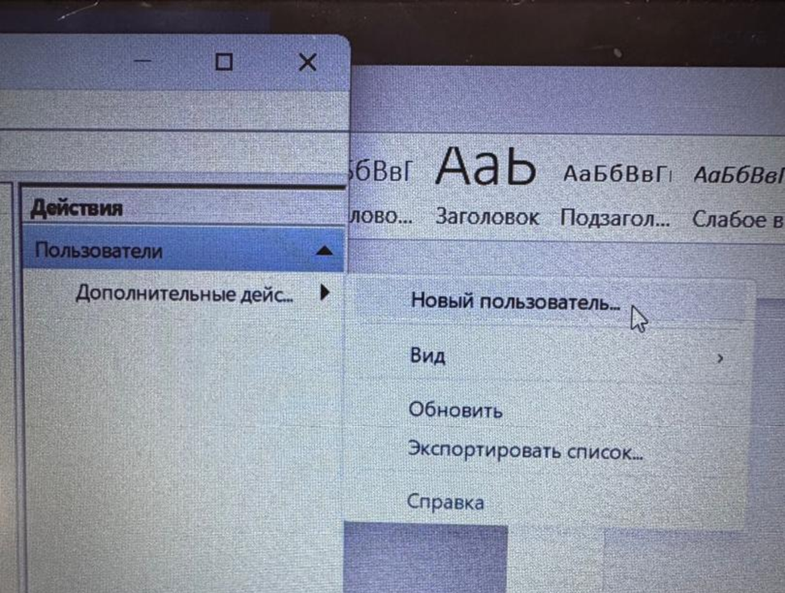
Для этого я на правой панели нажала на кнопку Дополнительные действия. Затем на Новый пользователь. 

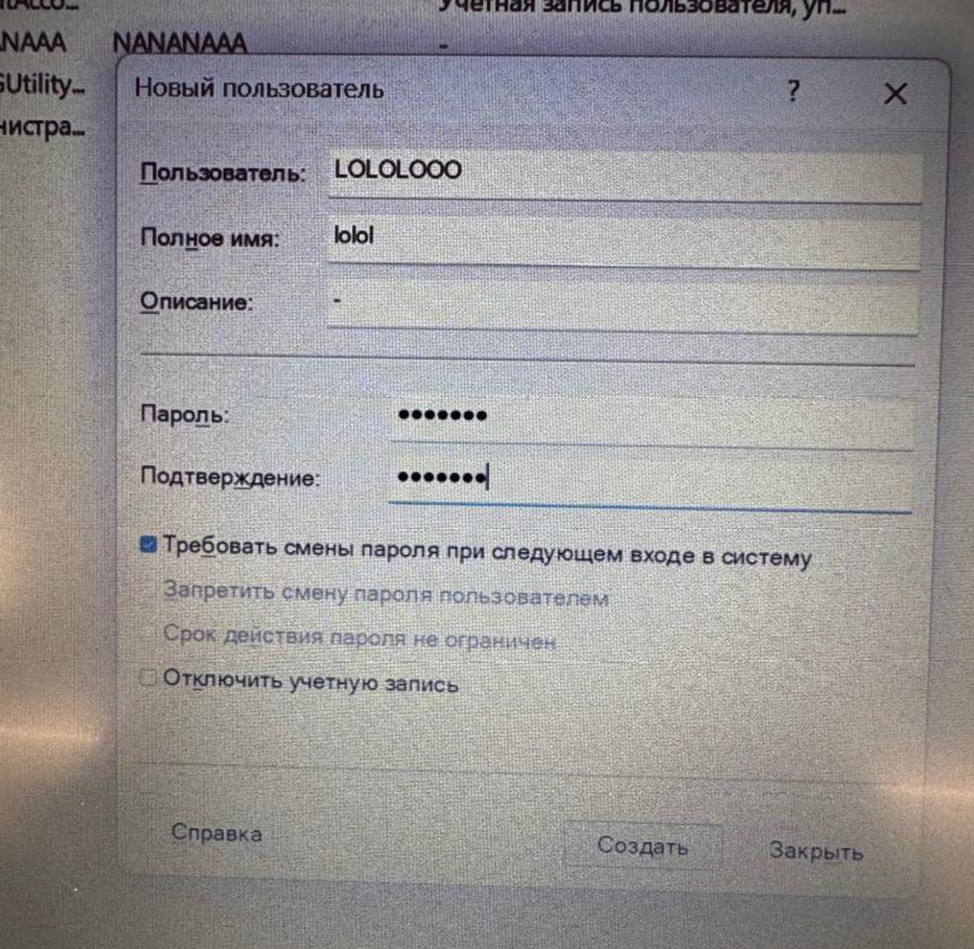
К примеру мы создали пользователя LOLOLOOO. Задали ему имя и описание если хотите, Также пароль. Нажимаем кнопку создать и ваш пользователь появится в листе. 

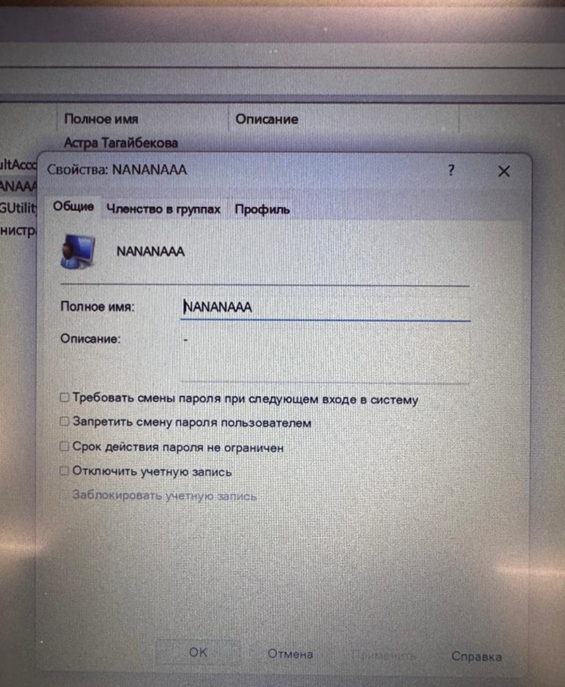
Мы видим, что таким образом я создала пользователя NANANAAA. Дальше мы будем работать с ним. 

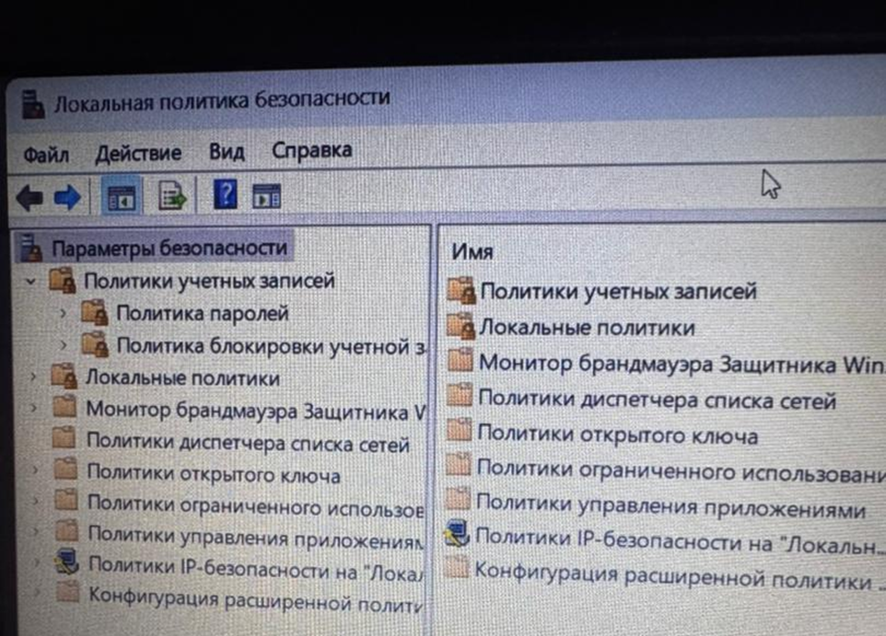
Далее заходим в локальную политику безопасности. Там заходим в параметры безопасности. У нас появится окно, где нужно выбрать Политики учетных записей. 

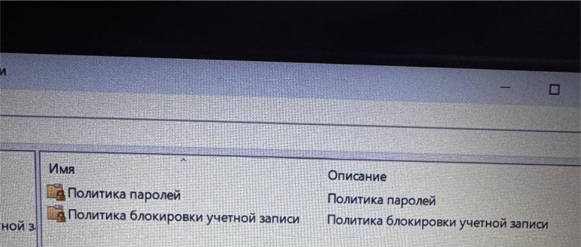
Далее выбираем политики блокировки учетных записей. 

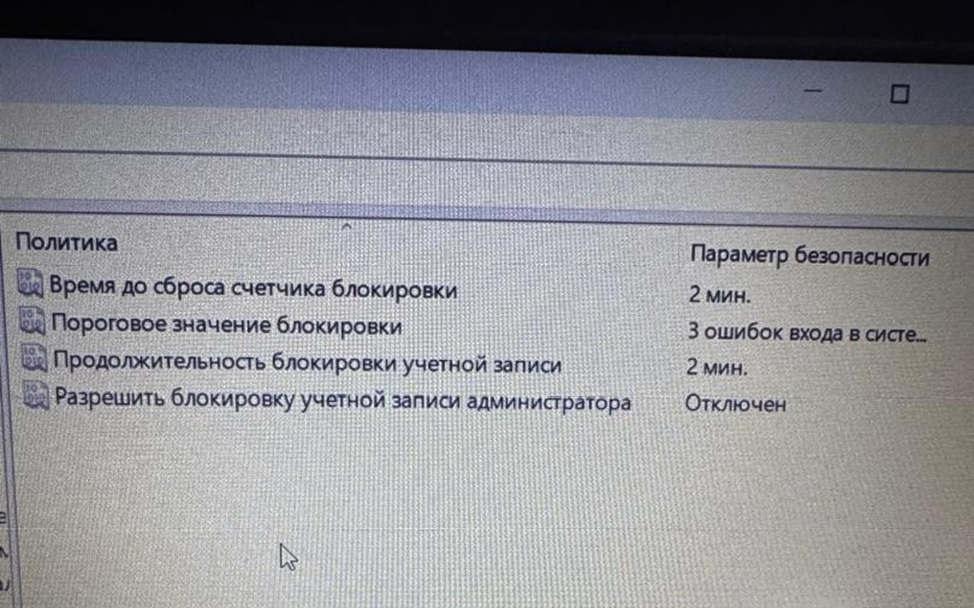
Меняем время до сброса счетчика до 2 минут. Пороговое значение блокировки на 3 ошибки. Продолжительность до 2 минут и не запрещайте блокировку учетной записи админа. Все как показано на экране. Далее будем тестировать.

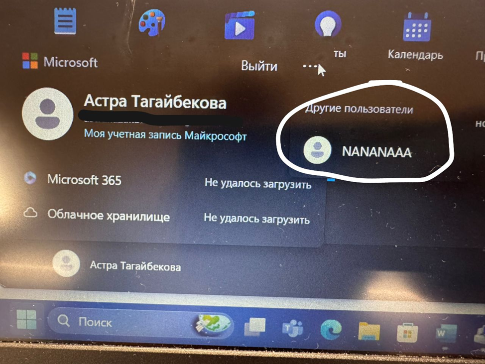
И нажимаем Пуск. Теперь мы должны зайти от имени пользователя. Нажимаем на Другие Пользователи и у нас выходят все созданные пользователи и кликаем по нему. 
Далее будет долгая перезагрузка компьютера. Нельзя его в это время выключать. 
После перезагрузки выйдет окно, где надо будет ввести пароль для учетной записи пользователя:

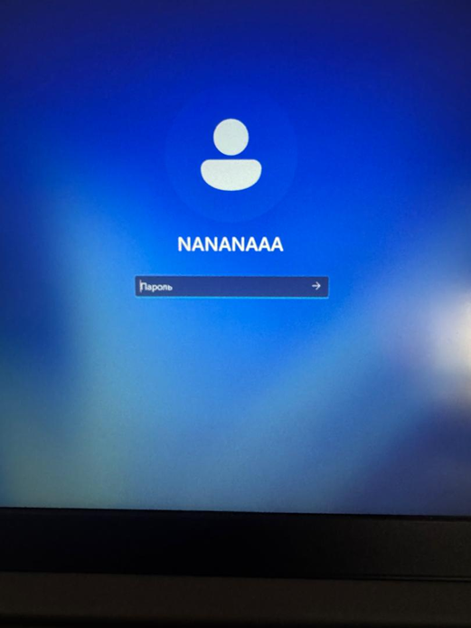
Далее просто вводите какие-нибудь пароли, чтобы проверить работает ли блокировка пароля при неверном вводе. 

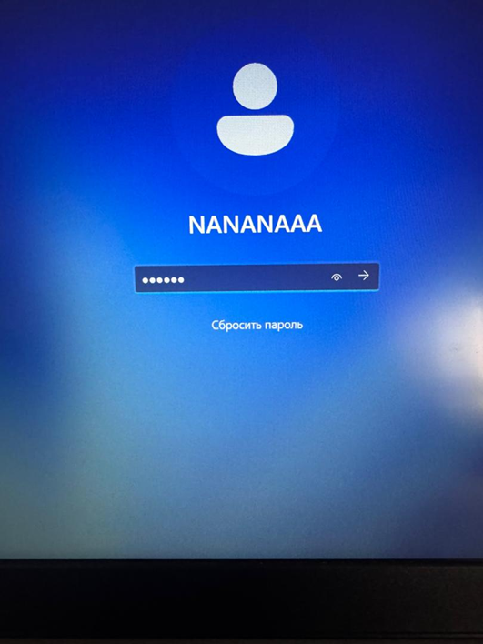
И вводите 3 раза (так мы настроили) неправильно.

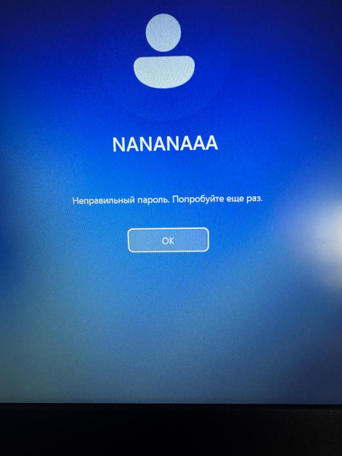
И теперь мы можем наблюдать как у нас вышла блокировка ввода. Теперь ждем 2 минуты ,как мы настроили до

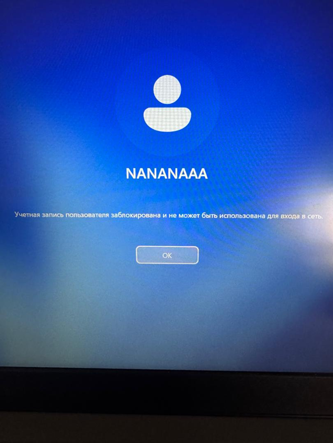
Ну и потом вводим правильный пароль для учетной записи и входим в нашу систему. Как вы видите мы сейчас зашли под пользователем NANANAA.

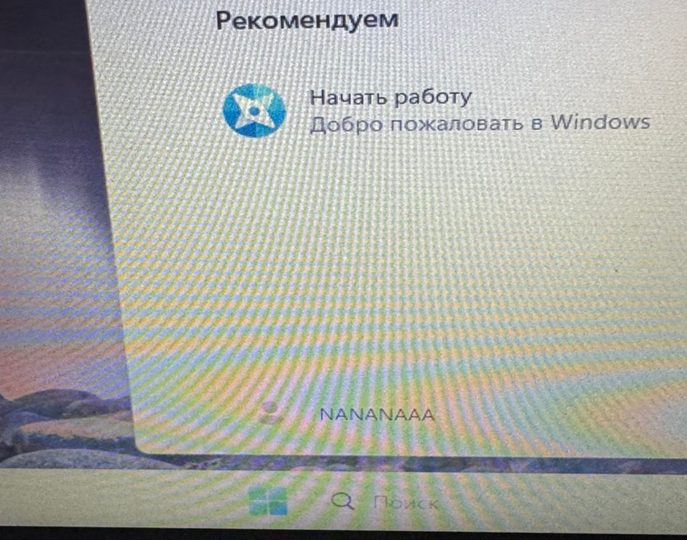
